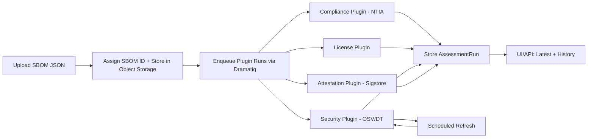

# ADR-003: Plugin-based Assessments for SBOM Uploads

## Status

Proposed

## Date

2025-12-15

## Context

sbomify ingests SBOMs primarily as JSON in CycloneDX and SPDX formats. When an SBOM is uploaded, sbomify runs multiple assessments asynchronously using Dramatiq workers.

### Assessment Categories

| Category        | Description                                                                                           | Deterministic                      | Re-run Triggers                     |
| --------------- | ----------------------------------------------------------------------------------------------------- | ---------------------------------- | ----------------------------------- |
| **Security**    | Integrate with tools/APIs like OSV or Dependency-Track. Results change as vulnerability data evolves. | No                                 | Upload, scheduled refresh, manual   |
| **License**     | Evaluate against approved/disapproved license policies.                                               | Yes (for given policy version)     | Upload, policy change, manual       |
| **Compliance**  | Evaluate against criteria for a regulation/guideline (e.g., NTIA Minimum Elements, CRA).              | Yes (for given ruleset version)    | Upload, ruleset change, manual      |
| **Attestation** | Verify integrity/provenance/signatures. Supports both Sigstore bundles and in-toto attestations.      | Mostly (depends on trust material) | Upload, trust config change, manual |

### Current Implementation Issues

The existing codebase has two divergent patterns:

1. **NTIA Compliance** - Results stored directly on the SBOM model as fields (`ntia_compliance_status`, `ntia_compliance_details`, `ntia_compliance_checked_at`). This overwrites previous results with no historical tracking.
2. **Vulnerability Scanning** - Uses a separate `VulnerabilityScanResult` model with proper historical tracking, but lacks plugin versioning and config hashing.

Neither approach follows a unified plugin contract, making it difficult to:

- Add new assessment types consistently
- Track assessment configuration changes
- Maintain audit trails
- Compare results across plugin versions

### Design Principles

- **Uploads are first-class objects** identified by the SBOM's primary key. The same SBOM content (including the same bom-id) may be uploaded multiple times as separate records.
- **SBOM content is not stored in the database** - the SBOM is stored in external object storage and referenced via a storage pointer.
- **Assessments are immutable records** - each run produces a new record, enabling historical analysis.

## Decision

### 1. Use SBOM ID as the Primary Identity for Assessments

Every assessment run is tied to an SBOM record's primary key (`sbom.id`). This is the existing 20-character string ID used throughout sbomify's APIs and database.

Results are **not** keyed by SBOM content hash, bom-id, or other SBOM-internal identifiers. This correctly models that multiple uploads of identical content are distinct events that should be assessed independently.

### 2. Framework Handles Storage, Plugins Receive File Paths

The framework abstracts all storage concerns from plugins:

1. **Framework responsibility**: Fetch SBOM from object storage and make it available on disk
2. **Plugin responsibility**: Read the SBOM from the provided file path and run assessment logic

Plugins never interact with storage directly. They receive:

- `sbom_id`: The SBOM's primary key for result association
- `sbom_path`: A `Path` to the SBOM file on disk (temporary, managed by framework)
- `config`: Optional plugin-specific configuration (e.g., policy rules)

The framework uses existing utilities (e.g., `get_sbom_data_bytes()`) to fetch SBOM content from S3, writes it to a temporary file, and passes the path to the plugin. This mirrors the current pattern used by OSV scanning but centralizes lifecycle management.

### 3. Python SDK Defines the Plugin Contract

Plugins are Python packages implementing the sbomify plugin SDK. Plugins execute asynchronously via Dramatiq.

Plugins may:

- Perform native evaluation in Python (license checks, compliance rules)
- Call third-party tools/APIs (OSV, Dependency-Track, Sigstore) and normalize their output

All plugins return a normalized `AssessmentResult` with `Finding` entries, using the schema defined below.

#### Plugin Interface

```python
from abc import ABC, abstractmethod
from dataclasses import dataclass
from enum import Enum
from pathlib import Path
from typing import Any, Optional

class AssessmentCategory(str, Enum):
    SECURITY = "security"
    LICENSE = "license"
    COMPLIANCE = "compliance"
    ATTESTATION = "attestation"

@dataclass
class PluginMetadata:
    """
    Metadata about a plugin for tracking and reproducibility.

    The framework uses this to populate AssessmentResult fields and
    denormalize into AssessmentRun for efficient querying.
    """
    name: str                    # e.g., "ntia-minimum-elements", "osv", "dependency-track"
    version: str                 # Semantic version of the plugin
    category: AssessmentCategory # Original source; flows to result and run

class AssessmentPlugin(ABC):
    """Base class for all assessment plugins."""

    def __init__(self, config: Optional[dict] = None):
        """
        Initialize plugin with optional configuration.

        Args:
            config: Plugin-specific configuration (e.g., policy rules, thresholds).
                    The framework computes config_hash from this for tracking.
        """
        self.config = config or {}

    @abstractmethod
    def get_metadata(self) -> PluginMetadata:
        """Return plugin metadata including name, version, and category."""
        pass

    @abstractmethod
    def assess(self, sbom_id: str, sbom_path: Path) -> "AssessmentResult":
        """
        Run the assessment against the SBOM.

        The framework handles:
        - Fetching the SBOM from object storage
        - Writing it to a temporary file
        - Passing the path to this method
        - Cleaning up the temporary file after assessment

        Args:
            sbom_id: The SBOM's primary key (for result association)
            sbom_path: Path to the SBOM file on disk (read-only, temporary)

        Returns:
            Normalized AssessmentResult
        """
        pass
```

The framework orchestrates plugin execution:

```python
class AssessmentOrchestrator:
    """Framework component that manages plugin execution."""

    def run_assessment(self, sbom_id: str, plugin: AssessmentPlugin) -> AssessmentRun:
        """
        Execute a plugin assessment with full lifecycle management.

        1. Fetch SBOM from object storage to temporary file
        2. Compute config_hash from plugin.config
        3. Call plugin.assess() with sbom_id and file path
        4. Store AssessmentRun record with results
        5. Clean up temporary file
        """
        # Implementation handles all storage and lifecycle concerns
        ...
```

#### Plugin Configuration and Enablement

Plugins are **configured per-team** rather than discovered at runtime via entry points. This allows:

- **Feature gating**: Different billing plans can enable different plugins (e.g., NTIA compliance only for Business/Enterprise)
- **User control**: Teams can choose which assessments to run on their SBOMs
- **Billing alignment**: Plugin usage can be tracked for metered billing if needed

Plugin enablement is stored in team settings:

```python
class TeamAssessmentSettings(models.Model):
    """Team-specific assessment plugin configuration."""

    team = models.OneToOneField("teams.Team", on_delete=models.CASCADE)

    # Enabled plugins (feature-gated by billing plan)
    enabled_plugins = models.JSONField(default=list)  # e.g., ["ntia", "osv", "license-policy"]

    # Plugin-specific configuration
    plugin_configs = models.JSONField(default=dict)  # e.g., {"license-policy": {"allowed": ["MIT", "Apache-2.0"]}}
```

### 4. Store Results as Immutable Assessment Runs

Each execution produces an immutable **AssessmentRun** record:

```python
class AssessmentRun(models.Model):
    """Immutable record of a single assessment execution."""

    class RunStatus(models.TextChoices):
        PENDING = "pending", "Pending"
        RUNNING = "running", "Running"
        COMPLETED = "completed", "Completed"
        FAILED = "failed", "Failed"

    class RunReason(models.TextChoices):
        ON_UPLOAD = "on_upload", "On Upload"
        SCHEDULED_REFRESH = "scheduled_refresh", "Scheduled Refresh"
        MANUAL = "manual", "Manual Request"
        CONFIG_CHANGE = "config_change", "Configuration Change"
        PLUGIN_UPDATE = "plugin_update", "Plugin Version Update"

    # Identity
    id = models.UUIDField(primary_key=True, default=uuid.uuid4)
    sbom = models.ForeignKey("sboms.SBOM", on_delete=models.CASCADE, related_name="assessment_runs")

    # Plugin identification (copied from AssessmentResult for denormalized querying)
    plugin_name = models.CharField(max_length=100)      # e.g., "ntia-minimum-elements"
    plugin_version = models.CharField(max_length=50)    # e.g., "1.2.0"
    plugin_config_hash = models.CharField(max_length=64)  # SHA256 of config
    category = models.CharField(max_length=20, choices=...)  # Copied from result.category

    # Execution metadata
    run_reason = models.CharField(max_length=30, choices=RunReason.choices)
    status = models.CharField(max_length=20, choices=RunStatus.choices, default=RunStatus.PENDING)
    started_at = models.DateTimeField(null=True)
    completed_at = models.DateTimeField(null=True)
    error_message = models.TextField(blank=True)

    # Audit: who/what triggered this run
    triggered_by_user = models.ForeignKey(
        "core.User", on_delete=models.SET_NULL, null=True, blank=True,
        help_text="User who triggered a manual run (null for automated runs)"
    )
    triggered_by_token = models.ForeignKey(
        "access_tokens.AccessToken", on_delete=models.SET_NULL, null=True, blank=True,
        help_text="API token used to trigger the run (null for UI or automated runs)"
    )

    # Input reference (populated by framework, not plugin)
    input_content_digest = models.CharField(max_length=64, blank=True)  # SHA256 of SBOM content for auditability

    # Results (JSON following AssessmentResult schema)
    result = models.JSONField(null=True)
    result_schema_version = models.CharField(max_length=10, default="1.0")

    # Large output storage (optional, for tools that produce verbose output)
    raw_output_key = models.CharField(max_length=255, blank=True)  # S3 key for raw tool output

    # Timestamps
    created_at = models.DateTimeField(auto_now_add=True)

    class Meta:
        indexes = [
            models.Index(fields=["sbom", "plugin_name", "-created_at"]),
            models.Index(fields=["sbom", "plugin_name", "plugin_config_hash", "-created_at"]),
            models.Index(fields=["category", "-created_at"]),
            models.Index(fields=["status", "-created_at"]),
        ]
        ordering = ["-created_at"]
```

**"Current" results** are derived as the latest successful run per `(sbom_id, plugin_name, plugin_config_hash)`.

### 5. Config Hash Specification

The framework computes `plugin_config_hash` from the plugin's `config` dictionary. This hash must capture all inputs that affect assessment results:

| Plugin                 | Config Hash Inputs                                                         |
| ---------------------- | -------------------------------------------------------------------------- |
| NTIA Minimum Elements  | Ruleset version, element weights, strictness level                         |
| OSV                    | Severity mapping rules, ecosystem filters                                  |
| Dependency-Track       | DT server version, policy configuration, severity mappings                 |
| License Policy         | Allowed licenses list, denied licenses list, expression engine version     |
| Attestation (Sigstore) | Trust root fingerprints, OIDC issuer allowlist, timestamp authority config |
| Attestation (in-toto)  | Trusted functionary keys, layout policy hash, predicate type filters       |

Example config hash computation:

```python
import hashlib
import json

def compute_config_hash(config: dict) -> str:
    """Compute deterministic hash of plugin configuration."""
    # Sort keys for deterministic serialization
    serialized = json.dumps(config, sort_keys=True, separators=(",", ":"))
    return hashlib.sha256(serialized.encode()).hexdigest()
```

### 6. Assessment Result Schema (v1.0)

```python
@dataclass
class Finding:
    """A single finding from an assessment."""
    # Required fields
    id: str                      # Stable ID, e.g., "ntia:supplier-present", "CVE-2024-1234"
    title: str                   # Human-readable title
    description: str             # Detailed description

    # Severity (required for security findings, defaults to "info" for compliance)
    severity: str = "info"       # "critical" | "high" | "medium" | "low" | "info" | "none" | "unknown"

    # Compliance-oriented fields (used by NTIA, license, etc.)
    status: Optional[str] = None  # "pass" | "fail" | "warning" | "error" (None for security findings)

    # Component identification
    component: Optional[dict] = None  # {"name": str, "version": str, "purl": str, "ecosystem": str}

    # Security-oriented fields (used by OSV, DT, etc.)
    cvss_score: Optional[float] = None     # Numeric CVSS score (e.g., 9.8)
    references: Optional[list[str]] = None  # URLs to advisories, patches, etc.
    aliases: Optional[list[str]] = None     # Cross-references (CVE-xxx, GHSA-xxx, etc.)
    published_at: Optional[str] = None      # ISO-8601 when vulnerability was published
    modified_at: Optional[str] = None       # ISO-8601 when vulnerability was last modified

    # VEX (Vulnerability Exploitability eXchange) fields
    # See: CycloneDX ImpactAnalysisState, ImpactAnalysisJustification, ResponseEnum
    analysis_state: Optional[str] = None        # "resolved" | "exploitable" | "in_triage" | "false_positive" | "not_affected"
    analysis_justification: Optional[str] = None  # "code_not_present" | "code_not_reachable" | "requires_configuration" | etc.
    analysis_response: Optional[list[str]] = None  # ["update", "workaround_available", "will_not_fix", etc.]
    analysis_detail: Optional[str] = None       # Free-text explanation of the analysis

    # Common optional fields
    remediation: Optional[str] = None       # Suggested fix or recommendation
    evidence_key: Optional[str] = None      # S3 key for large evidence payloads
    metadata: Optional[dict] = None         # Plugin-specific additional data


@dataclass
class AssessmentSummary:
    """
    Summary statistics for the assessment.

    Supports both compliance-style (pass/fail counts) and
    security-style (severity counts) summaries.
    """
    total_findings: int

    # Compliance-style counts (for NTIA, license, etc.)
    pass_count: int = 0
    fail_count: int = 0
    warning_count: int = 0
    error_count: int = 0

    # Security-style counts (for OSV, DT, etc.)
    by_severity: Optional[dict] = None  # {"critical": 0, "high": 1, "medium": 2, "low": 5, "unknown": 0}


@dataclass
class AssessmentResult:
    """
    Normalized result from any assessment plugin.

    Note: plugin_name, plugin_version, and category are copied from PluginMetadata
    by the framework. The AssessmentRun model denormalizes these fields for efficient
    querying without deserializing the JSON result.
    """
    schema_version: str = "1.0"
    plugin_name: str
    plugin_version: str
    category: str                # Authoritative source; copied to AssessmentRun.category
    assessed_at: str             # ISO-8601 timestamp
    summary: AssessmentSummary
    findings: list[Finding]
    metadata: Optional[dict] = None  # Plugin-specific metadata
```

### 7. Time-Variant Re-runs

- **Security** plugins run on upload and may re-run via scheduled jobs (e.g., weekly) or manual trigger, because vulnerability databases are continuously updated.

- **License** and **Compliance** plugins run on upload and are re-run only on:
  - Plugin version change
  - `plugin_config_hash` change (policy/ruleset updates)
  - Manual request

- **Attestation** plugins run on upload when attestation material is present and may be re-run on:
  - Trust configuration change (captured in `plugin_config_hash`)
  - Manual request

## Migration Strategy

### Phase 1: Create AssessmentRun Model

1. Create the `AssessmentRun` model in a new `assessments` app
2. Add database indexes for efficient querying
3. Implement the base `AssessmentPlugin` interface

### Phase 2: Migrate Vulnerability Scanning

1. Refactor `VulnerabilityScanResult` data into `AssessmentRun` format
2. Create OSV and Dependency-Track plugins implementing the SDK
3. Update `VulnerabilityScanningService` to use the plugin system
4. Run data migration to copy historical records
5. Deprecate `VulnerabilityScanResult` model

### Phase 3: Migrate NTIA Compliance

1. Create NTIA plugin implementing the SDK
2. Migrate existing `NTIAValidator` logic into the plugin
3. Create initial `AssessmentRun` records from existing SBOM fields
4. Deprecate NTIA fields on SBOM model (keep read-only for backwards compatibility)

### Future: Additional Plugin Types (Roadmap)

The following plugins are on the roadmap but not yet scheduled:

1. **License Policy plugin** - Evaluate SBOMs against allowed/denied license lists
2. **Attestation plugin** - Verify integrity and provenance using:
   - Sigstore bundles (cosign signatures, Rekor transparency log)
   - in-toto attestations (SLSA provenance, custom predicates)
   - The plugin may support both formats, with configuration determining which checks are performed
3. **VEX plugin** - Import and apply VEX (Vulnerability Exploitability eXchange) statements to findings, setting analysis_state, justification, and response fields
4. **CRA (Cyber Resilience Act) compliance plugin** - EU regulatory compliance checks

## Example: NTIA Minimum Elements Plugin

```python
import json
from pathlib import Path

class NTIAMinimumElementsPlugin(AssessmentPlugin):
    """Plugin for NTIA Minimum Elements compliance checking."""

    VERSION = "1.0.0"
    RULESET_VERSION = "2021-07"  # NTIA report version

    def __init__(self, config: dict = None):
        super().__init__(config)
        # Config could include strictness level, custom element weights, etc.

    def get_metadata(self) -> PluginMetadata:
        return PluginMetadata(
            name="ntia-minimum-elements",
            version=self.VERSION,
            category=AssessmentCategory.COMPLIANCE,
        )

    def assess(self, sbom_id: str, sbom_path: Path) -> AssessmentResult:
        # Read SBOM from the path provided by the framework
        sbom_data = json.loads(sbom_path.read_text())

        # Run validation checks
        findings = []
        findings.extend(self._check_supplier_name(sbom_data))
        findings.extend(self._check_component_name(sbom_data))
        findings.extend(self._check_version(sbom_data))
        findings.extend(self._check_unique_identifiers(sbom_data))
        findings.extend(self._check_dependencies(sbom_data))
        findings.extend(self._check_author(sbom_data))
        findings.extend(self._check_timestamp(sbom_data))

        return AssessmentResult(
            schema_version="1.0",
            plugin_name="ntia-minimum-elements",
            plugin_version=self.VERSION,
            category="compliance",
            assessed_at=datetime.now(timezone.utc).isoformat(),
            summary=self._compute_summary(findings),
            findings=findings,
        )
```

Example findings:

| Finding ID                      | Title                            | Status    |
| ------------------------------- | -------------------------------- | --------- |
| `ntia:supplier-present`         | Supplier Information Present     | pass/fail |
| `ntia:component-name`           | Component Name Present           | pass/fail |
| `ntia:component-version`        | Component Version Present        | pass/fail |
| `ntia:unique-identifiers`       | Unique Identifiers Present       | pass/fail |
| `ntia:dependency-relationships` | Dependency Relationships Present | pass/fail |
| `ntia:sbom-author`              | SBOM Author Present              | pass/fail |
| `ntia:timestamp`                | Creation Timestamp Present       | pass/fail |

## Architecture Diagram



## Consequences

### Positive

- **Correct identity model**: Assessments are tied to the upload (SBOM record), not SBOM content
- **Works with "no SBOMs in DB"**: All inputs/large outputs use storage references
- **Uniform results model**: Consistent schema across native checks and third-party tools
- **Historical tracking**: All runs are preserved for audit and trend analysis
- **Reproducibility**: Config hashing enables understanding of result changes
- **Extensibility**: New plugins can be added without modifying core models

### Negative / Tradeoffs

- Storage grows over time as all assessment runs are kept (no automatic pruning)
- UI/API must clearly represent "current" vs historical runs
- Plugin SDK and schemas must be versioned carefully to avoid breaking plugins
- Migration effort for existing NTIA and vulnerability scanning data

## Alternatives Considered

1. **Key results by bom-id or content hash**: Rejected because the same SBOM may be uploaded multiple times, and uploads are first-class objects.
2. **Use Rego/OPA as default normalization/evaluation layer**: Rejected for added complexity; Python SDK is primary, with Rego support possible as a future plugin type.
3. **Store results on SBOM model (current NTIA pattern)**: Rejected because it loses history, doesn't track config changes, and doesn't scale to multiple plugin types.
4. **Separate tables per assessment type**: Rejected in favor of unified `AssessmentRun` model for consistency and simpler querying.

## Resolved Design Questions

1. **SBOM Identity**: Use the existing `sbom.id` (20-character string) as the assessment identity. No UUID migration required.
2. **API Compatibility**: APIs continue to use `sbom.id` consistently across all endpoints.
3. **Plugin Discovery**: Plugins are configured per-team via `TeamAssessmentSettings`, with feature gating based on billing plans. No runtime entry-point discovery.
4. **License Plugin**: Roadmap item (not yet scheduled).
5. **Attestation Scope**: The attestation plugin will support both Sigstore bundles and in-toto attestations. Configuration determines which verification methods are applied.
6. **Result Retention**: All assessment runs are kept forever. No automatic pruning.

## References

- [NTIA Minimum Elements for SBOM](https://www.ntia.gov/files/ntia/publications/sbom_minimum_elements_report.pdf)
- [OSV Schema](https://ossf.github.io/osv-schema/)
- [CycloneDX Specification](https://cyclonedx.org/specification/overview/)
- [CycloneDX VEX](https://cyclonedx.org/capabilities/vex/)
- [Sigstore](https://www.sigstore.dev/)
- [in-toto Attestation Framework](https://in-toto.io/)
- [SLSA Provenance](https://slsa.dev/provenance/)
