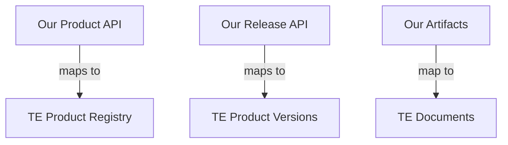

# CycloneDX Transparency Exchange Compatibility

## Overview

Our API is designed to be compatible with the emerging CycloneDX Transparency Exchange API while providing additional functionality. This document outlines how our API maps to the Transparency Exchange specification and our plans for future compatibility.

## Key Concepts Mapping

### Product Registry



### Current Compatibility Layer

```http
# Our Native API
POST /api/v2/products/{id}/releases
{
    "version": "1.0.0",
    "artifacts": [...]
}

# Transparency Exchange Compatible Endpoint
POST /api/v2/te/products/{product-id}/versions/{version}/documents
{
    "documentType": "bom",
    "mediaType": "application/vnd.cyclonedx+json",
    "algorithm": "SHA-256",
    "hash": "...",
    "url": "..."
}
```

## Compatibility Endpoints

We provide parallel endpoints that follow the Transparency Exchange specification:

### Products

```http
# List Products
GET /api/v2/te/products
    ?page=0
    ?size=20
    ?sort=name,asc

# Get Product
GET /api/v2/te/products/{product-id}

# Create Product
POST /api/v2/te/products
{
    "name": "string",
    "organizationId": "string",
    "description": "string",
    "externalReferences": []
}
```

### Product Versions

```http
# List Versions
GET /api/v2/te/products/{product-id}/versions

# Get Version
GET /api/v2/te/products/{product-id}/versions/{version}

# Create Version
POST /api/v2/te/products/{product-id}/versions
{
    "version": "string",
    "status": "string",
    "externalReferences": []
}
```

### Documents

```http
# List Documents
GET /api/v2/te/products/{product-id}/versions/{version}/documents

# Upload Document
POST /api/v2/te/products/{product-id}/versions/{version}/documents
{
    "documentType": "string",
    "mediaType": "string",
    "algorithm": "string",
    "hash": "string",
    "url": "string",
    "externalReferences": []
}
```

## Data Model Mapping

### Product Mapping

```json
{
    // Our Native Format
    "id": "uuid",
    "name": "string",
    "identifiers": {
        "purl": "pkg:supplier/product@version"
    },

    // Maps to TE Format
    "te_compatible": {
        "productId": "uuid",
        "name": "string",
        "organizationId": "derived-from-workspace",
        "externalReferences": [
            {
                "type": "purl",
                "url": "pkg:supplier/product@version"
            }
        ]
    }
}
```

### Document Mapping

```json
{
    // Our Native Format
    "type": "sbom",
    "format": "cyclonedx",
    "content": {},

    // Maps to TE Format
    "te_compatible": {
        "documentType": "bom",
        "mediaType": "application/vnd.cyclonedx+json",
        "algorithm": "SHA-256",
        "hash": "computed-from-content",
        "url": "generated-download-url"
    }
}
```

## Implementation Strategy

1. **Dual Endpoints**
   - Maintain our native API for full functionality
   - Provide TE-compatible endpoints for standards compliance
   - Automatic mapping between formats

2. **Forward Compatibility**
   - Monitor TE API development
   - Implement new TE features as they stabilize
   - Maintain backward compatibility

3. **Extended Functionality**
   - Support additional artifact types beyond TE spec
   - Provide richer relationship model
   - Enhanced search capabilities

## Migration Guide

For users wanting to be TE-compatible:

1. **Use TE Endpoints**

   ```python
   # Instead of
   POST /api/v2/artifacts

   # Use
   POST /api/v2/te/products/{id}/versions/{version}/documents
   ```

2. **Document Upload**

   ```python
   # Our API handles both methods:

   # Direct upload
   POST /api/v2/artifacts
   {
       "content": { ... }
   }

   # TE-style URL reference
   POST /api/v2/te/products/{id}/versions/{version}/documents
   {
       "url": "https://...",
       "hash": "..."
   }
   ```

3. **Search Compatibility**

   ```python
   # Our native search
   GET /api/v2/search/artifacts?type=sbom

   # TE-compatible search
   GET /api/v2/te/products/{id}/versions/{version}/documents
       ?documentType=bom
   ```

## Future Considerations

1. **API Evolution**
   - Monitor TE specification changes
   - Adapt to new requirements
   - Maintain compatibility layer

2. **Extended Features**
   - Support additional document types
   - Enhanced relationship models
   - Advanced search capabilities

3. **Tooling Support**
   - Provide SDK for both APIs
   - Migration utilities
   - Validation tools
