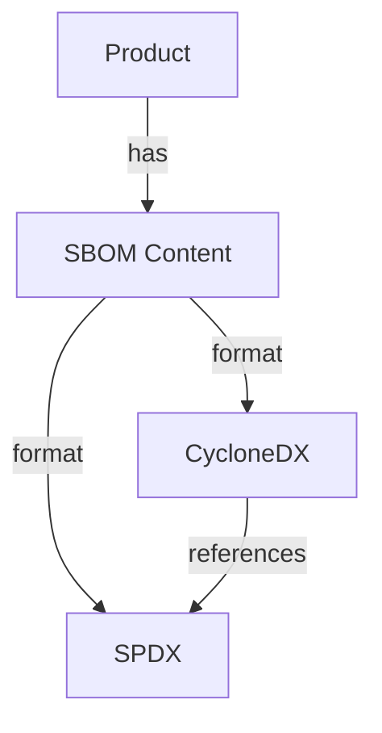
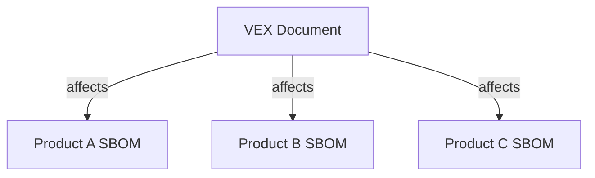
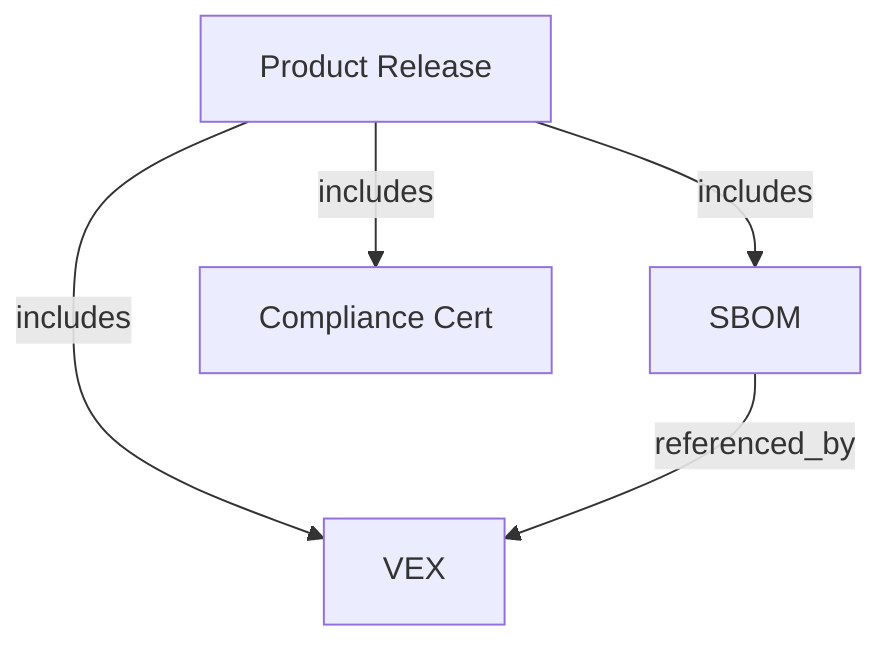
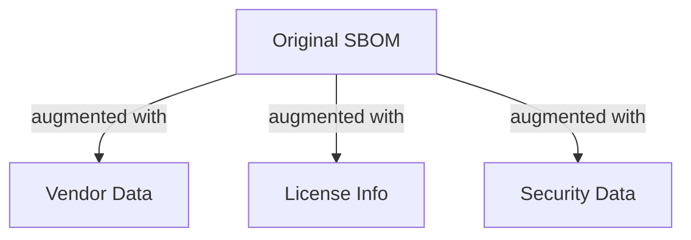

# Common Use Cases

## Overview

This guide provides detailed examples of common use cases and the logic behind them in the Security Artifact Hub.

## 1. Managing Multiple SBOM Formats

### SBOM Format Scenario

You have a product that needs both CycloneDX and SPDX SBOMs for different consumers.



### SBOM Format Implementation

```http
# Create a release
POST /api/v2/projects/{id}/releases
{
    "version": "1.0.0",
    "status": "draft"
}

# Upload CycloneDX format
POST /api/v2/projects/{id}/releases/1.0.0/artifacts
{
    "type": "sbom",
    "format": "cyclonedx",
    "content": { ... }
}

# Upload equivalent SPDX format
POST /api/v2/projects/{id}/releases/1.0.0/artifacts
{
    "type": "sbom",
    "format": "spdx",
    "content": { ... },
    "relationships": [
        {
            "type": "equivalent_to",
            "target_id": "cyclonedx-sbom-uuid"
        }
    ]
}

# Retrieve all formats
GET /api/v2/projects/{id}/releases/1.0.0/artifacts?type=sbom
```

## 2. VEX File Affecting Multiple Products

### VEX Impact Scenario

A vulnerability affects multiple products, and you need to create a VEX document that references all affected SBOMs.



### VEX Impact Implementation

```http
# Upload VEX document
POST /api/v2/projects/{id}/releases/1.0.0/artifacts
{
    "type": "vex",
    "format": "csaf",
    "content": {
        "document": {
            "category": "csaf_vex",
            "title": "Multiple Product Advisory"
        },
        "product_tree": {
            "branches": [
                // Product definitions
            ]
        },
        "vulnerabilities": [
            {
                "cve": "CVE-2023-12345",
                "product_status": {
                    "fixed": ["PRODUCT-A-1.0.0"]
                }
            }
        ]
    }
}

# System automatically:
# 1. Parses the CSAF document
# 2. Identifies affected products
# 3. Creates relationships
# 4. Indexes for search
```

## 3. Product Release with Multiple Artifacts

### Release Artifacts Scenario

You're releasing a new product version that requires multiple security artifacts.



### Release Artifacts Implementation

```http
# 1. Create release
POST /api/v2/projects/{id}/releases
{
    "version": "1.0.0",
    "status": "draft",
    "metadata": {
        "purl": "pkg:supplier/product@1.0.0"
    }
}

# 2. Upload SBOM
POST /api/v2/projects/{id}/releases/1.0.0/artifacts
{
    "type": "sbom",
    "format": "cyclonedx",
    "content": { ... }
}

# 3. Upload Compliance Certificate
POST /api/v2/projects/{id}/releases/1.0.0/artifacts
{
    "type": "certification",
    "format": "iso27001",
    "content": {
        "issuer": "Certification Body",
        "valid_from": "2024-01-01",
        "valid_until": "2025-01-01"
    }
}

# 4. Get all artifacts for release
GET /api/v2/projects/{id}/releases/1.0.0/artifacts
```

## 4. Artifact Augmentation

### Augmentation Scenario

You want to enhance an SBOM with additional metadata from various sources.



### Augmentation Implementation

```http
# 1. Get augmentation data
GET /api/v2/projects/{id}/releases/{version}/artifacts/{artifact-id}/augment
{
    "sources": ["vendor", "license", "security"],
    "options": {
        "vendor": {
            "include_contact": true
        },
        "security": {
            "include_advisories": true
        }
    }
}

# 2. Apply augmentation
PATCH /api/v2/projects/{id}/releases/{version}/artifacts/{artifact-id}
{
    "content": {
        // Augmented SBOM content
    },
    "metadata": {
        "augmentation": {
            "timestamp": "2024-01-23T12:00:00Z",
            "sources": ["vendor", "license", "security"]
        }
    }
}
```

## 5. Vulnerability Impact Analysis

### Scenario

You need to identify all products affected by a specific vulnerability.

### Implementation

```http
# Search for affected products
GET /api/v2/search/artifacts
    ?cve=CVE-2023-12345
    ?type=vex,sbom
    ?include_relationships=true

Response:
{
    "artifacts": [
        {
            "id": "vex-uuid",
            "type": "vex",
            "affects": [
                {
                    "product_id": "uuid",
                    "version": "1.0.0",
                    "status": "affected"
                }
            ]
        },
        {
            "id": "sbom-uuid",
            "type": "sbom",
            "affected_by": [
                {
                    "vex_id": "vex-uuid",
                    "cve": "CVE-2023-12345"
                }
            ]
        }
    ]
}
```

## Best Practices

1. **Relationship Management**
   - Always specify relationships when uploading related artifacts
   - Use appropriate relationship types
   - Keep relationship metadata current

2. **Version Handling**
   - Use semantic versioning where possible
   - Include version information in artifact metadata
   - Maintain version consistency across related artifacts

3. **Search Optimization**
   - Include relevant identifiers (PURL, CPE)
   - Use consistent naming conventions
   - Keep metadata fields standardized

4. **Artifact Updates**
   - Preserve relationship information when updating artifacts
   - Update related artifacts when necessary
   - Maintain audit trail in metadata
  </rewritten_file>
