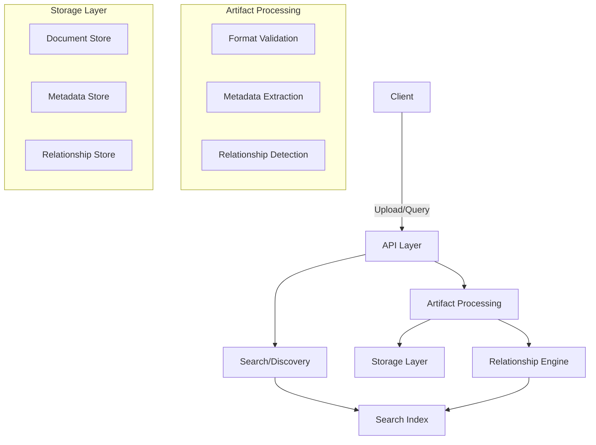
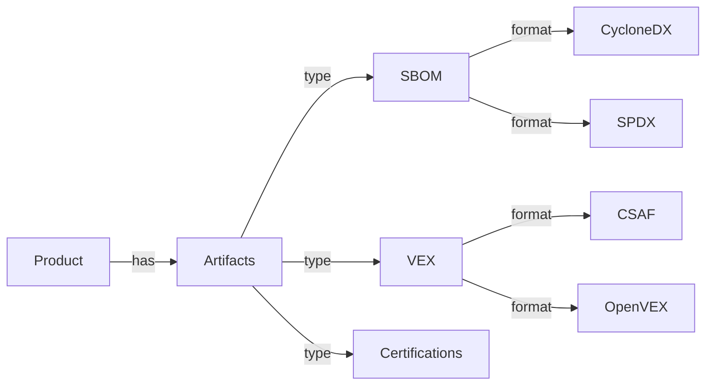

# Architecture Overview

## System Overview

The Security Artifact Hub is designed to be a central repository for security-related artifacts, providing discovery, relationship management, and search capabilities.



## Core Concepts

### 1. Products and Artifacts

Products are the central organizational unit, representing software or systems that have associated security artifacts. Each product can have multiple artifacts of different types.



### 2. Artifact Relationships

Artifacts can have complex relationships with each other. For example:

- A VEX file can reference multiple SBOMs
- An SBOM can have multiple formats (SPDX, CycloneDX)
- Certifications can apply to specific product versions

### 3. Discovery and Search

The system provides multiple ways to discover artifacts:

- By product identifier (PURL, CPE)
- By vulnerability (CVE)
- By certification type
- By relationship to other artifacts

## Data Models

### Product

```python
class Product:
    id: UUID
    name: str
    identifiers: Dict[str, str]  # purl, cpe, etc.
    metadata: Dict[str, Any]
```

### Artifact

```python
class Artifact:
    id: UUID
    type: str  # sbom, vex, cert
    format: str  # cyclonedx, spdx, csaf
    content: Dict[str, Any]
    metadata: Dict[str, Any]
```

### Relationship

```python
class Relationship:
    source_id: UUID
    target_id: UUID
    type: str  # references, describes, certifies
    metadata: Dict[str, Any]
```

## Next Steps

- [API Design](../api/README.md)
- [Data Storage](storage.md)
- [Search Implementation](search.md)
