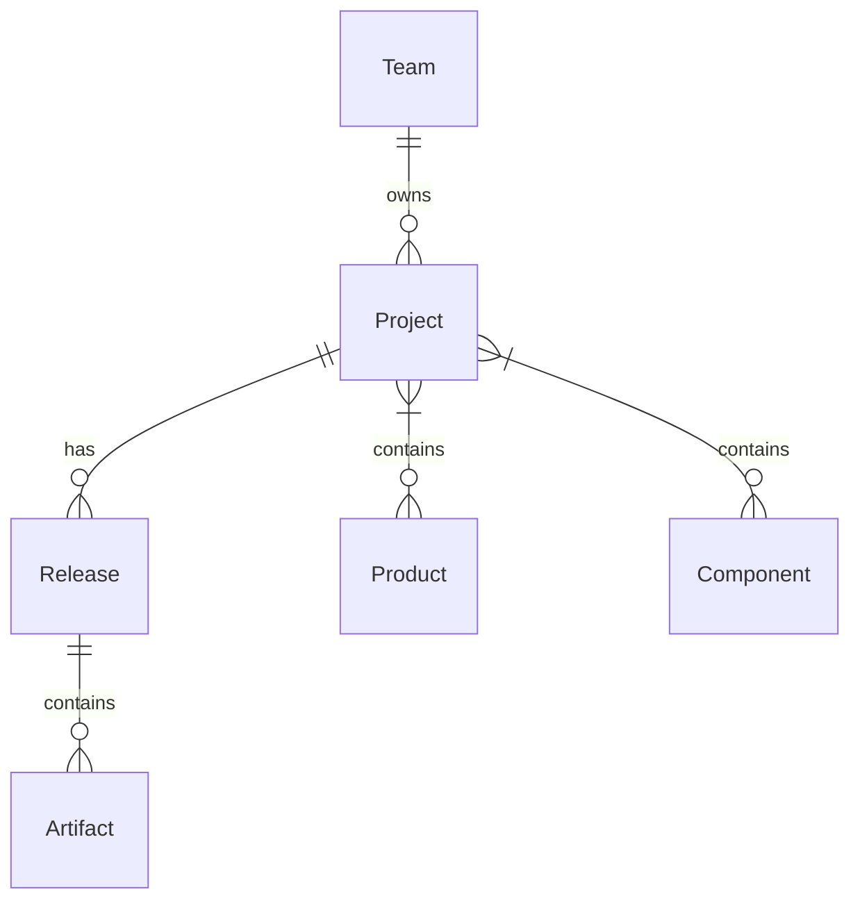

# Data Model

## Overview

This document details the data model for our release-based architecture, including entity relationships, schemas, and validation rules. The model is designed to be compatible with the CycloneDX Transparency Exchange API (TEA) in the future while maintaining a clean, simple interface for current needs.

## Core Entities

### Project Model Definition

```python
class Project(models.Model):
    """
    A project represents a logical grouping of products and components
    """
    team = models.ForeignKey(Team)
    name = models.CharField()
    products = models.ManyToManyField(Product)
    components = models.ManyToManyField(Component)
    metadata = models.JSONField()
```

### Release Model Definition

```python
class Release(models.Model):
    """
    A release represents a point-in-time snapshot of a project
    """
    project = models.ForeignKey(Project)
    version = models.CharField()
    release_date = models.DateTimeField()
    status = models.CharField()  # draft, released, archived
    metadata = models.JSONField()
```

### Artifact Model Definition

```python
class Artifact(models.Model):
    """
    An artifact is any security document (SBOM, VEX, etc.)
    Designed for future TEA compatibility while maintaining simplicity
    """
    release = models.ForeignKey(Release)
    type = models.CharField()  # sbom, vex, etc.
    format = models.CharField()  # cyclonedx, spdx, csaf
    content = models.JSONField()
    metadata = models.JSONField()
    parsed_data = models.JSONField(null=True)  # Parsed and validated content
```

## Relationships



## Validation Rules

### Project Validation Rules

- Name must be unique within a team
- Must have at least one product or component
- Metadata schema must be valid

### Release Validation Rules

- Version must be unique within a project
- Status must be one of: draft, released, archived
- Release date required for released status

### Artifact Validation Rules

- Type must be one of: sbom, vex
- Format must match type (e.g., cyclonedx/spdx for sbom)
- Content must validate against format schema
- VEX documents are parsed server-side to determine applicability
- Relationships between artifacts are extracted and stored in metadata

## VEX Processing

### Server-Side Parsing

1. When a VEX document is uploaded:
   - Document is validated against schema
   - Applicability statements are parsed
   - Affected products and versions are identified
   - Relationships to SBOMs are determined automatically

### Applicability Rules

1. Product Identification:
   - Parse product identifiers
   - Match against known products
   - Extract version ranges

2. SBOM Matching:
   - Compare component identifiers
   - Check version compatibility
   - Validate product context

3. Relationship Creation:
   - Create bidirectional links
   - Store in metadata
   - Update search indices

## JSON Schemas

### Project Metadata

```json
{
    "type": "object",
    "properties": {
        "description": {
            "type": "string"
        },
        "tags": {
            "type": "array",
            "items": {
                "type": "string"
            }
        },
        "external_references": {
            "type": "array",
            "items": {
                "type": "object",
                "properties": {
                    "type": {"type": "string"},
                    "url": {"type": "string"}
                }
            }
        }
    }
}
```

### Release Metadata

```json
{
    "type": "object",
    "properties": {
        "release_notes": {
            "type": "string"
        },
        "approvers": {
            "type": "array",
            "items": {
                "type": "string"
            }
        },
        "release_type": {
            "type": "string",
            "enum": ["major", "minor", "patch"]
        }
    }
}
```

### Artifact Metadata

```json
{
    "type": "object",
    "properties": {
        "generator": {
            "type": "object",
            "properties": {
                "name": {"type": "string"},
                "version": {"type": "string"}
            }
        },
        "created_at": {
            "type": "string",
            "format": "date-time"
        },
        "relationships": {
            "type": "array",
            "items": {
                "type": "object",
                "properties": {
                    "type": {"type": "string"},
                    "target": {"type": "string"}
                }
            }
        }
    }
}
```

## Migration Considerations

### From Current Model

1. Create Release for each existing Component
2. Convert SBOMs to Artifacts
3. Preserve existing relationships
4. Maintain backward compatibility

### Data Integrity

1. Validate all data during migration
2. Create integrity checks
3. Add database constraints
4. Implement validation hooks

## Best Practices

1. **Schema Evolution**
   - Use migrations for schema changes
   - Maintain backward compatibility
   - Version metadata schemas
   - Document changes

2. **Validation**
   - Validate at model level
   - Add database constraints
   - Implement business rules
   - Check relationships

3. **Performance**
   - Index key fields
   - Optimize queries
   - Cache common lookups
   - Batch operations

## Future TEA Compatibility

The data model is designed to evolve towards TEA compatibility:

1. **Document Types**
   - Current: Simple SBOM and VEX
   - Future: Full TEA document types
   - Migration path defined

2. **Relationships**
   - Current: Basic metadata links
   - Future: Full TEA relationship model
   - Extensible structure

3. **Identifiers**
   - Current: UUIDs and basic naming
   - Future: TEA-compatible URNs
   - Backward compatible

4. **Content Model**
   - Current: JSON storage
   - Future: TEA-aligned schemas
   - Gradual transition support

```python
# Additional code examples
```
