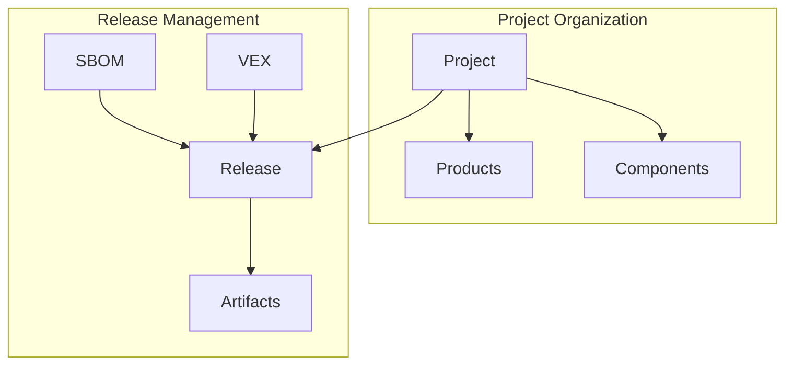

# Release-Based Architecture

## Overview

This document outlines our transition to a release-based architecture, where releases serve as point-in-time snapshots of projects and their associated security artifacts.

## Core Concepts

### Projects

- Organizational units that group related products and components
- Team-scoped for access control
- Can contain multiple products and components
- Support metadata for flexible extensions

### Releases

- Point-in-time snapshots of a project
- Version-controlled state
- Contains all security artifacts
- Represents a cohesive set of documentation

### Artifacts

- Security documents (SBOM, VEX, etc.)
- Associated with specific releases
- Support multiple formats
- Maintain relationships between documents
- Server-side parsing for VEX documents
- Automatic relationship detection

## Implementation Plan

### Phase 1: Model Updates

1. Create new Release model
2. Convert SBOM model to generic Artifact model
3. Add relationships between models
4. Update database schema
5. Implement VEX parsing engine

### Phase 2: API Implementation

1. Implement release management endpoints
2. Add artifact management endpoints
3. Update project endpoints for release support
4. Add search and discovery endpoints
5. Add VEX processing endpoints

### Phase 3: Data Migration

1. Create initial releases for existing projects
2. Migrate existing SBOMs to artifacts
3. Establish relationships
4. Validate data integrity
5. Process existing VEX documents

### Phase 4: Client Updates

1. Update UI for release management
2. Add artifact type support
3. Enhance search and filtering
4. Update documentation

## Best Practices

1. **Release Management**
   - Use semantic versioning
   - Include clear status transitions
   - Maintain artifact relationships
   - Document release contents
   - Track release dependencies

2. **Artifact Handling**
   - Validate formats before storage
   - Maintain content integrity
   - Support format migrations
   - Handle relationships properly
   - Parse VEX documents server-side
   - Automatically detect and verify relationships
   - Cache parsed results for performance

3. **Project Organization**
   - Clear naming conventions
   - Logical grouping of components
   - Consistent metadata usage
   - Regular cleanup of unused items
   - Track component dependencies

## VEX Integration

### Document Processing

1. **Upload Flow**
   - Validate VEX format
   - Parse document structure
   - Extract applicability rules
   - Identify affected components
   - Create relationships

2. **Relationship Management**
   - Automatic SBOM linking
   - Version range matching
   - Component identification
   - Bidirectional references

3. **Update Handling**
   - Track document versions
   - Update existing relationships
   - Maintain history
   - Notify affected parties

### Performance Considerations

1. **Processing**
   - Async parsing for large documents
   - Caching of parsed results
   - Batch relationship updates
   - Indexed search support

2. **Storage**
   - Efficient relationship storage
   - Quick lookup structures
   - Version control integration
   - Change tracking

## Future Considerations

1. **Extended Features**
   - Advanced version control
   - Release approval workflows
   - Automated artifact generation
   - Enhanced relationship tracking

2. **Performance**
   - Efficient artifact storage
   - Caching strategies
   - Batch operations
   - Search optimization

3. **Integration**
   - CI/CD pipeline integration
   - External system synchronization
   - Standards compatibility
   - API extensibility
