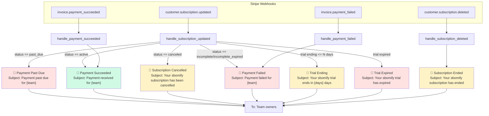
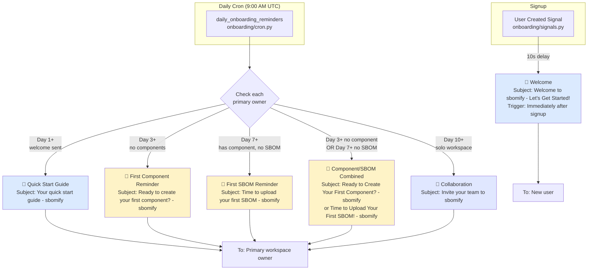
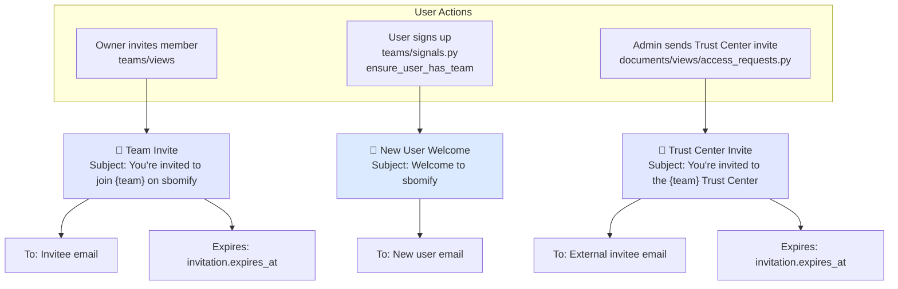
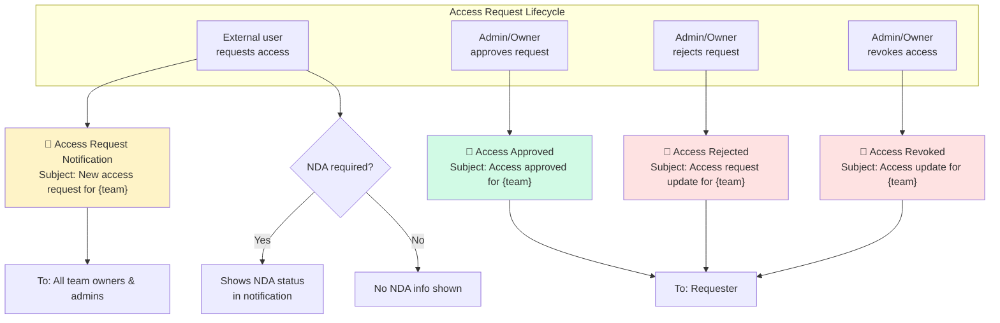
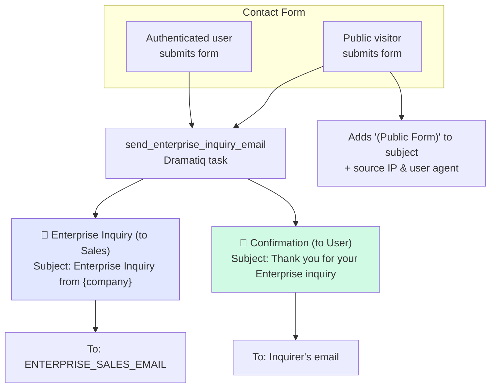
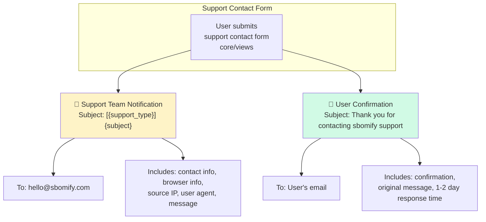

# Email Trigger Map

Diagram of the email flows in sbomify, including their triggers, conditions, and recipients.

## Overview

sbomify sends **24 distinct emails** across 6 categories:

| Category | Count | Trigger Type |
| -------- | ----- | ------------ |
| Billing | 7 | Stripe webhooks |
| Onboarding | 6 | User signup + daily cron drip |
| Team Invitations | 3 | User actions + signup signal |
| Document Access | 4 | Access request lifecycle |
| Enterprise Inquiry | 2 | Contact form |
| Support Contact | 2 | Support contact form |

---

## 1. Billing Emails

Triggered by Stripe webhook events, processed in `sbomify/apps/billing/billing_processing.py`. All billing emails are sent to **team owners only** via `notify_team_owners()`.

### Billing Email Details

| Email | Template | Has CTA | Plain Text |
| ----- | -------- | ------- | ---------- |
| Payment Past Due | `payment_past_due` | ✅ Update Payment | ✅ |
| Payment Failed | `payment_failed` | ✅ Update Payment | ✅ |
| Payment Succeeded | `payment_succeeded` | ❌ | ✅ |
| Trial Ending | `trial_ending` | ✅ Upgrade Now | ✅ |
| Trial Expired | `trial_expired` | ✅ Upgrade Now | ✅ |
| Subscription Cancelled | `subscription_cancelled` | ✅ Reactivate | ✅ |
| Subscription Ended | `subscription_ended` | ✅ Renew | ✅ |

---

## 2. Onboarding Emails

Welcome email triggered by user signup signal for every newly created user. Drip sequence processed by daily cron at **9:00 AM UTC** and sent to **primary workspace owners** only.

### Onboarding Drip Timeline

```mermaid
gantt
    title Onboarding Email Drip Schedule
    dateFormat X
    axisFormat Day %s

    section Emails
    Welcome (signup)           :done, 0, 1
    Quick Start (Day 1+)       :active, 1, 2
    First Component (Day 3+)   :crit, 3, 4
    First SBOM (Day 7+)        :crit, 7, 8
    Collaboration (Day 10+)    :10, 11
```

### Onboarding Conditions

| Email | Condition | Dedup |
| ----- | --------- | ----- |
| Welcome | User created | OnboardingStatus.welcome_email_sent |
| Quick Start | Day 1+, welcome sent | OnboardingEmail record |
| First Component | Day 3+, no components created | OnboardingEmail record |
| First SBOM | Day 7+, has component, no SBOM uploaded | OnboardingEmail record |
| Component/SBOM Combined | Day 3+ (no component) OR Day 7+ (no SBOM) | OnboardingEmail record |
| Collaboration | Day 10+, solo workspace (only 1 member) | OnboardingEmail record |

---

## 3. Team & Invitation Emails

Triggered by user signup flows and workspace management actions.

---

## 4. Document Access Emails

Triggered by the access request lifecycle for gated Trust Center content. Sent via views in `documents/views/access_requests.py` and APIs in `documents/access_apis.py`.

---

## 5. Enterprise Inquiry Emails

Triggered by the enterprise contact form. Sends two emails: one to the sales team and one confirmation to the inquirer. Processed async via Dramatiq task with max 3 retries.

---

## 6. Support Contact Emails

Triggered by the support contact form at `/support/contact/`. Email bodies are constructed inline (no templates). Sent synchronously.

---

## Sending Mechanisms

| Category | Mechanism | Async | Retry |
| -------- | --------- | ----- | ----- |
| Billing | `EmailMultiAlternatives` via `send_billing_email()` | No (sync in webhook handler) | No |
| Onboarding | `EmailMultiAlternatives` via Dramatiq tasks | Yes | 3 retries |
| Team Invite | `EmailMultiAlternatives` directly in view | No (sync) | No |
| New User Welcome | `EmailMultiAlternatives` in signal handler | No (sync) | No |
| Trust Center Invite | `EmailMultiAlternatives` directly in view | No (sync) | No |
| Document Access | `EmailMultiAlternatives` directly in view/API | No (sync) | No |
| Enterprise Inquiry | `EmailMessage` via Dramatiq task | Yes | 3 retries |
| Support Contact | `EmailMessage` directly in view | No (sync) | No |

---

## Key Files

| File | Role |
| ---- | ---- |
| `sbomify/apps/core/templates/core/emails/base.html.j2` | Base HTML email template |
| `sbomify/apps/core/views/__init__.py` | Support contact email sender |
| `sbomify/apps/billing/email_notifications.py` | Billing email sender functions |
| `sbomify/apps/billing/billing_processing.py` | Stripe webhook handlers (trigger billing emails) |
| `sbomify/apps/billing/tasks/__init__.py` | Enterprise inquiry Dramatiq task |
| `sbomify/apps/onboarding/signals.py` | Welcome email trigger (post-signup) |
| `sbomify/apps/onboarding/cron.py` | Daily drip cron job (9 AM UTC) |
| `sbomify/apps/onboarding/services/__init__.py` | Onboarding email service (send + eligibility) |
| `sbomify/apps/onboarding/tasks/__init__.py` | Onboarding Dramatiq tasks |
| `sbomify/apps/teams/signals.py` | New user welcome email trigger |
| `sbomify/apps/teams/views/__init__.py` | Team invite email sender |
| `sbomify/apps/documents/views/access_requests.py` | Document access emails (views) |
| `sbomify/apps/documents/access_apis.py` | Document access emails (API) |
